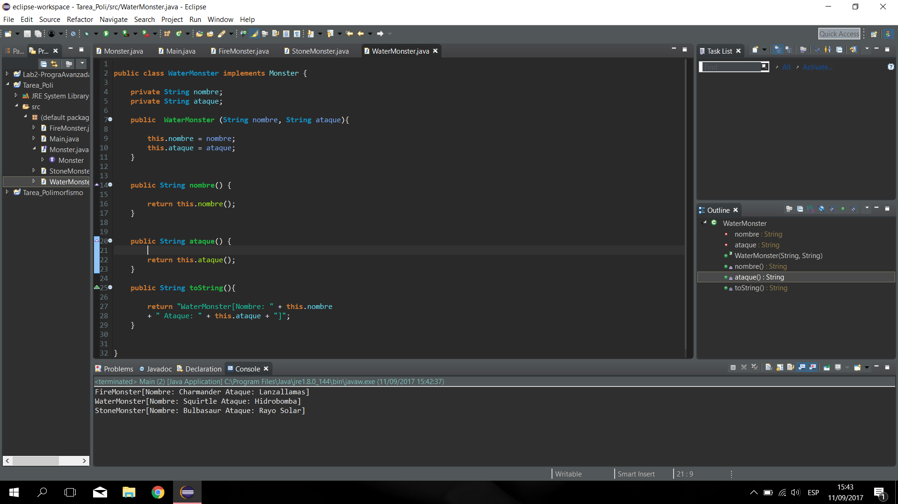
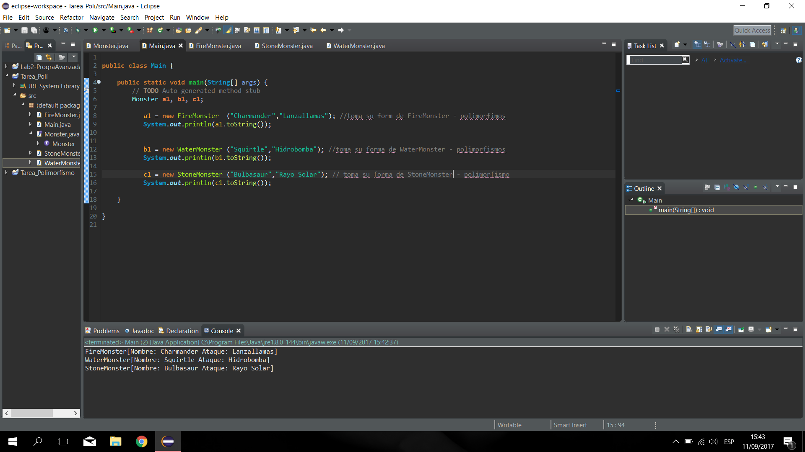

# Laboratorio 3 Programación Avanzada

### Carlos Andrés Cuéllar Velásquez 2497117
       
## a) Bitácora

1. Crear la clase Monster
   1.1 Se indica que es una interface y no una clase.
   1.2 Se declara los dos parametros que deben tener las otras dos sub clases que posteriormente se realizaran.

 

 
2. Crear la clase FireMonster

    2.1 Se declaran las variables de la clase FireMonster que seria nombre y ataque.

    2.2 Se crea el constructor que obtendra los valores de las variables. 

    2.3 Se escribe un to string para obtener el valor de todos los datos y organizarlos en una cadena alfanumerica. 

 
 
3. Crear la clase WaterMonster

    3.1 Se declaran las variables de la clase WaterMonster que seria nombre y ataque.

    3.2 Se crea el constructor que obtendra los valores de las variables. 

    3.3 Se escribe un to string para obtener el valor de todos los datos y organizarlos en una cadena alfanumerica. 
 
  
 
 
 4. Crear la clase StoneMonster

    4.1 Se declaran las variables de la clase StoneMonster que seria nombre y ataque.

    4.2 Se crea el constructor que obtendra los valores de las variables. 

    4.3 Se escribe un to string para obtener el valor de todos los datos y organizarlos en una cadena alfanumerica.
    
 
 
 

5. Crear la clase Main

    5.1 Se declaran los objetos de la clase Main.

    5.2 Se les da forma a los objetos anteriormente creados, dandole valores a los parametros. 

    5.3 Se imprimen llamando al metodo ToString, ejemplo: System.out.println("nombre del objeto".toString());

 
 
 
 
 
 

